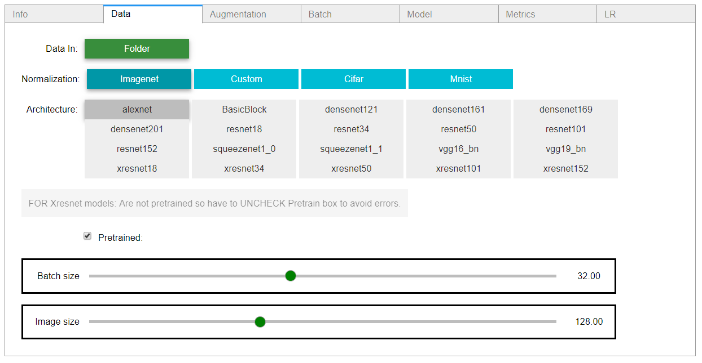
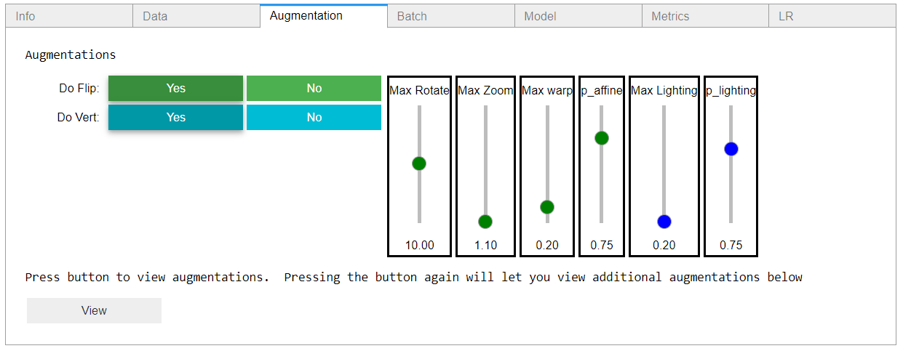
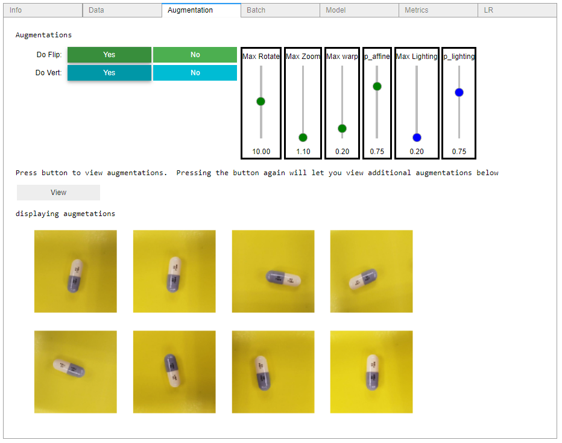
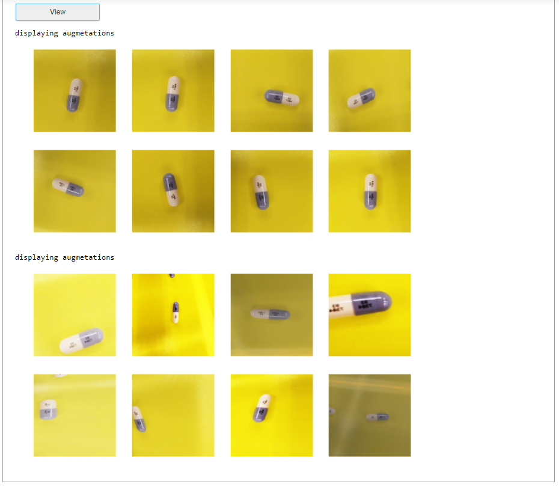
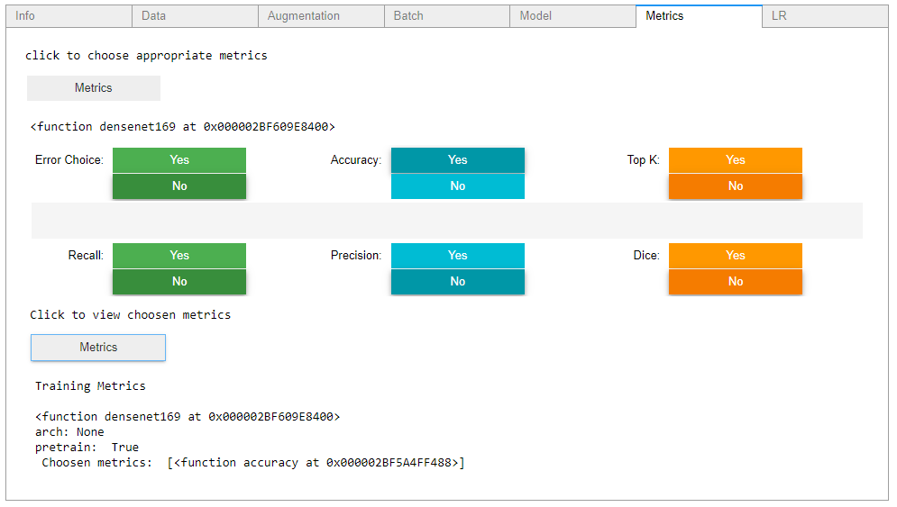
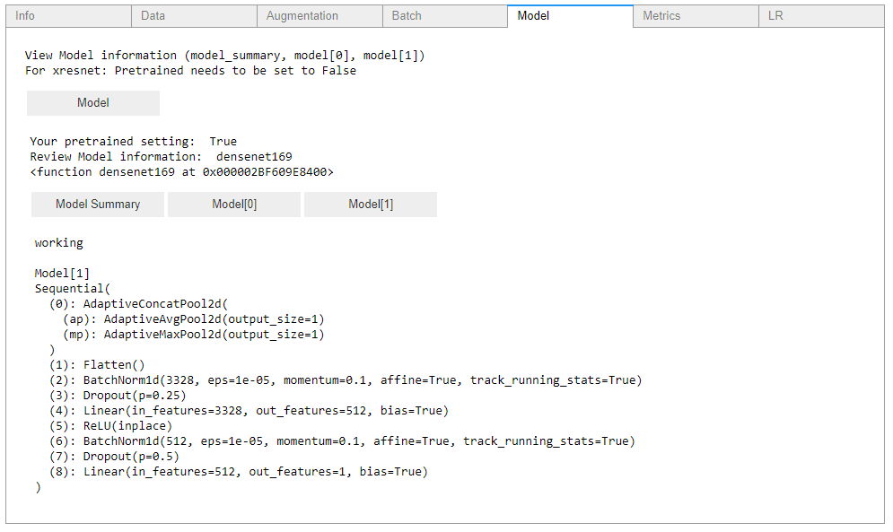

### Visual_UI
Visual UI interface for fastai

Aim to provide an easy to use graphical interface

  

The Augmentation tab utilizes fastai parameters so you can view what different image augmentations look like and compare

  

Review model data and choose suitable metrics for training

  

### Requirements
- fastai
I am using the developer version:

  

`git clone https://github.com/fastai/fastai`

`cd fastai`

`tools/run-after-git-clone`

`pip install -e ".[dev]"`

for installation instructions visit [Fastai Installation Readme](https://github.com/fastai/fastai/blob/master/README.md#installation) 

- ipywidgets

`pip install ipywidgets
jupyter nbextension enable --py widgetsnbextension`

or 

`conda install -c conda-forge ipywidgets`

for installation instructions visit [Installation docs](https://ipywidgets.readthedocs.io/en/stable/user_install.html)

- psutil

psutil (process and system utilities) is a cross-platform library for retrieving information on running processes and system utilization (CPU, memory, disks, network, sensors) in Python

`pip install psutil`

#### Known Issues

##### Google Colab

Colab does not currently support ipywidgets because their output is in its own frame so prevents ipywidets from working.  This is the link to issues thread [Link](https://github.com/googlecolab/colabtools/issues/60)
