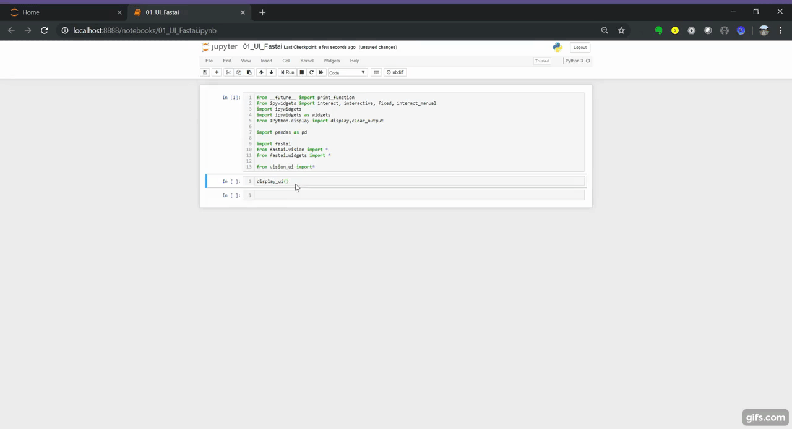
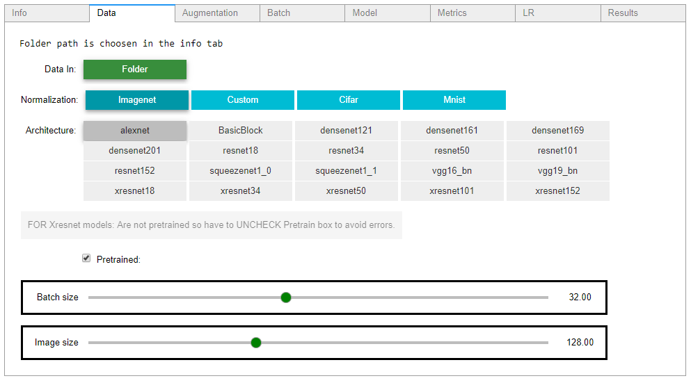
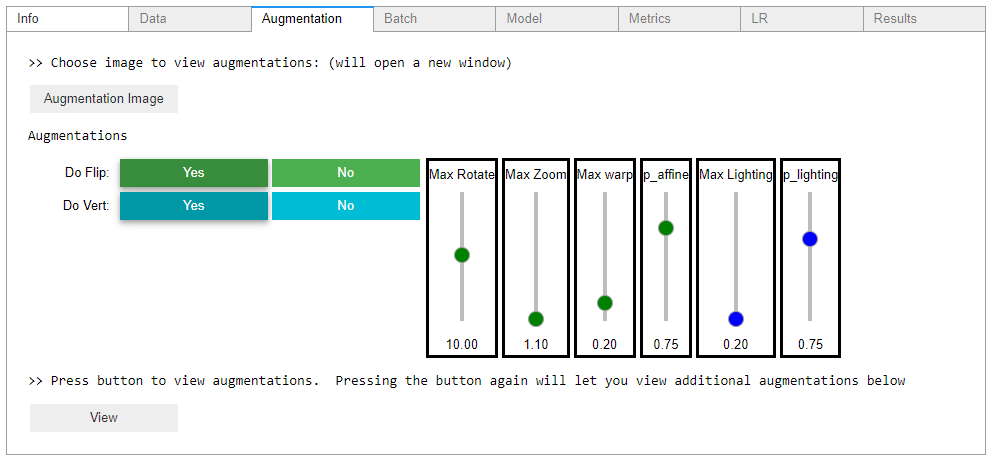
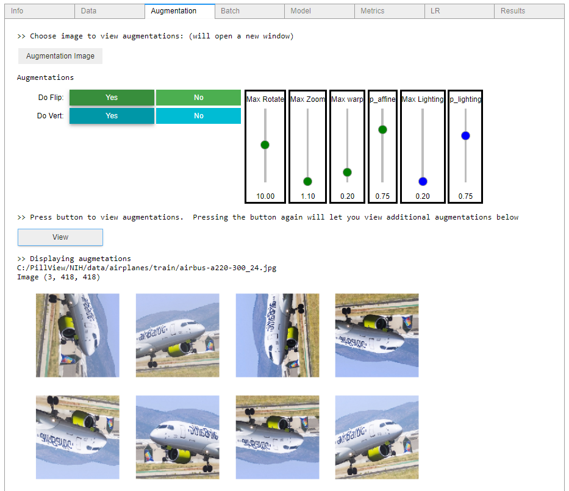
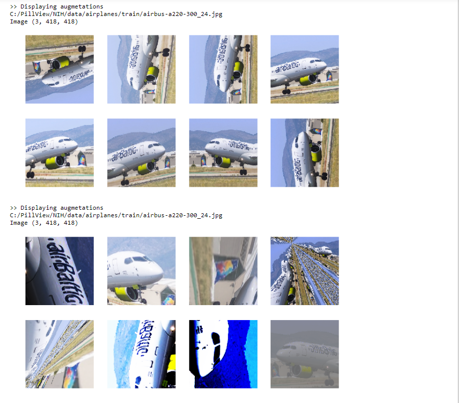
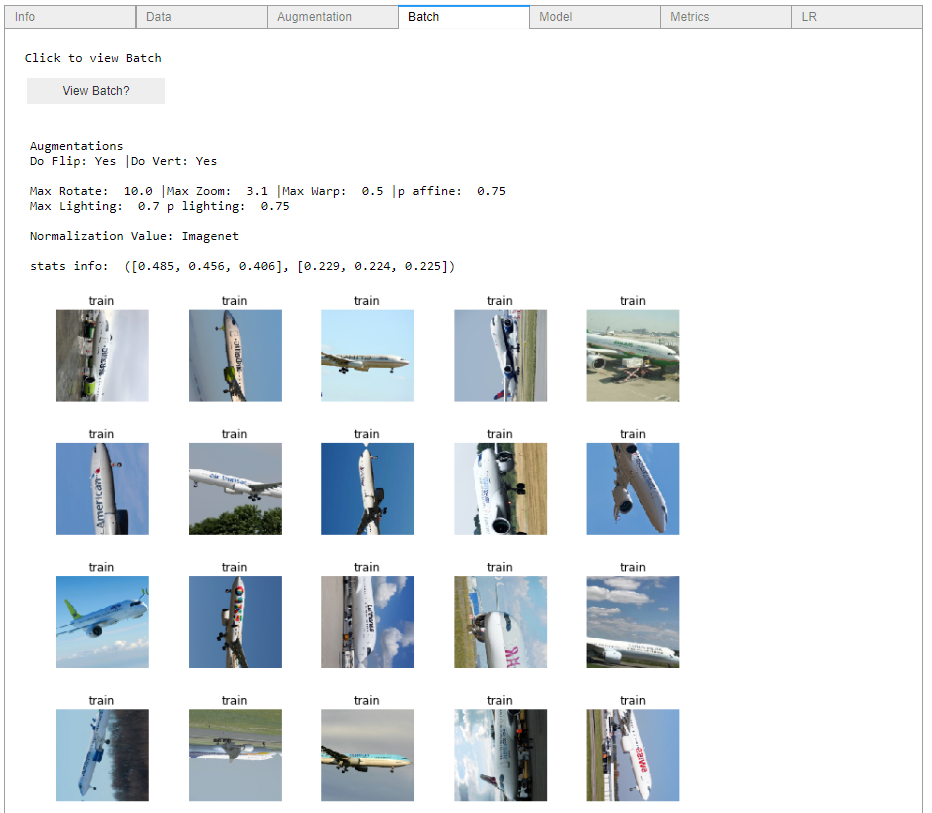
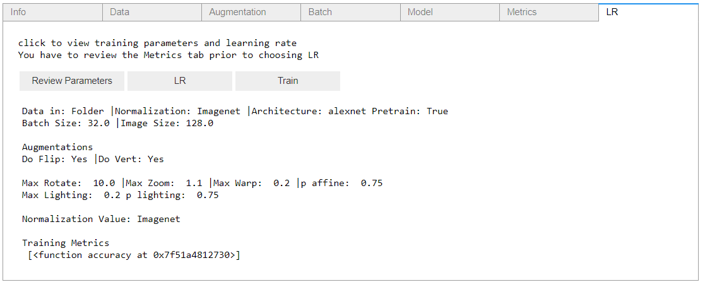
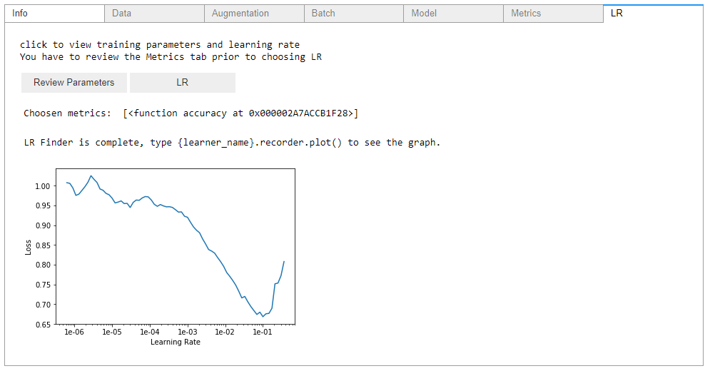
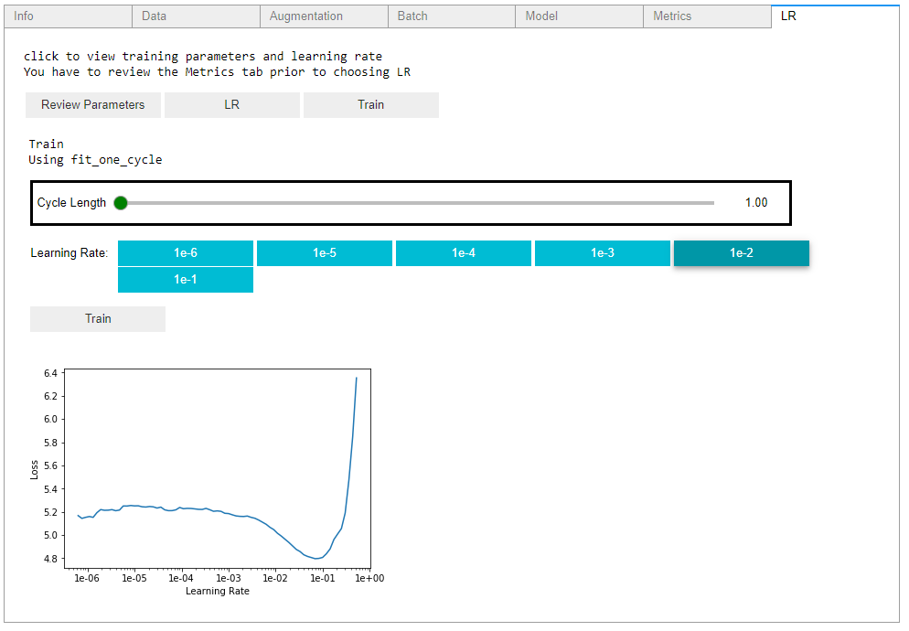
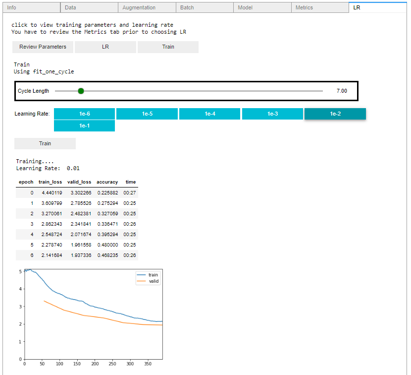

### Visual_UI
Visual UI interface for fastai

 

Aim to provide an easy to use graphical interface without the need to dig deep into the code.  This visual tool provides a good starting point to get training quickly using fastai.

________________________________________________________________________________________________________________________________________

### Updates

#### 07/09/2019
- after a train running, the model is saved in the models folder with the model name as 'architecture' + 'pretrained' + batchsize + image size eg: resnet50_pretrained_True_batch_32_image_128.pth
- updated tkinter askdirectory code: now after choosing a file the tkinter dialogue box will be destroyed - previously the box would remain open

#### 06/05/2019
- results tab added where you can load your saved model and plot multi_plot_losses, top_losses and Confusion_matrix

#### 06/03/2019  
- path and image_path (for augmentations) is now within vision_ui so no need to have a seperate cell to specify path
- included link to fastai docs and forum in 'info' tab 

________________________________________________________________________________________________________________________________________

All tabs are provided within an accordion design using ipywidgets, this allows for all aspects of choosing and viewing parameters in one line of sight

  

The Augmentation tab utilizes fastai parameters so you can view what different image augmentations look like and compare

  

View batch information

  

Review model data and choose suitable metrics for training

  

Review parameters get learning rate and train using the one cycle policy

  

Can experiment with various learning rates and train

  

### Requirements
- fastai

I am using the developer version:

  

`git clone https://github.com/fastai/fastai`

`cd fastai`

`tools/run-after-git-clone`

`pip install -e ".[dev]"`

for installation instructions visit [Fastai Installation Readme](https://github.com/fastai/fastai/blob/master/README.md#installation) 

- ipywidgets

`pip install ipywidgets
jupyter nbextension enable --py widgetsnbextension`

or 

`conda install -c conda-forge ipywidgets`

for installation instructions visit [Installation docs](https://ipywidgets.readthedocs.io/en/stable/user_install.html)

- psutil

psutil (process and system utilities) is a cross-platform library for retrieving information on running processes and system utilization (CPU, memory, disks, network, sensors) in Python

`pip install psutil`

### Installation

git clone this repository

`git clone https://github.com/asvcode/Vision_UI.git`

run `01_UI_Fastai.ipynb` ,specify your path and run `display_ui(path)`

### Known Issues

##### Google Colab

Colab does not currently support ipywidgets because their output is in its own frame so prevents ipywidets from working.  This is the link to issues thread [Link](https://github.com/googlecolab/colabtools/issues/60)

### Future Work

- Currently on works with images using the `ImageDataBunch.from_folder` option.  Plans to expand to `.from_csv` and `.from_df`
