### Visual_UI
Visual UI interface for fastai

   

Visual UI adds a graphical interface to fastai allowing the user to quickly load, choose parameters, train and view results without the need to dig deep into the code. 

________________________________________________________________________________________________________________________________________

### Updates

#### 12/23/2019
- Inclusion of ImageDataBunch.from_csv
- Additional augmentations included [cutout, jitter, contrast, brightness, rotate, symmetric warp, padding]
- Inclusion of ClassConfusion widget
- Addition of 'Code' tab to view code

#### 11/12/2019 
- Under the 'Info' tab you can now easily upload some common datasets: Cats&Dogs, Imagenette, Imagewoof, Cifar and Mnist

  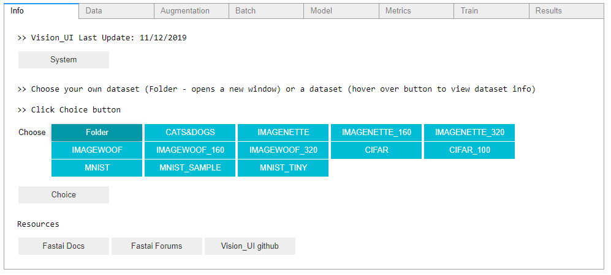

- Under the 'Results' tab if there are more than 2 classes the confusion matrix upgrades will not work but you can now view the confusion matrix

  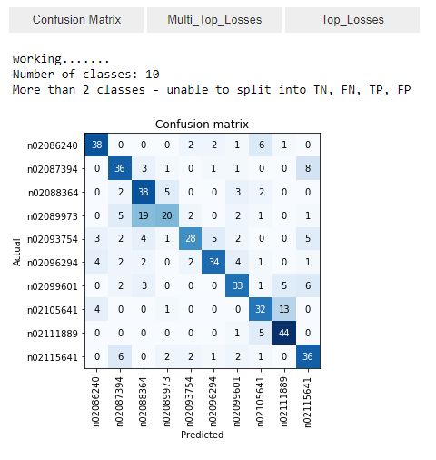

#### 10/12/2019 - 
- Works with Google Colab (https://github.com/asvcode/Colab_UI) - Results tab not currently available in Colab

#### 09/25/2019 - xresnet architecture
- xresnet architectures now working (using xresnet2.py from fastai)

#### 09/12/2019 - Confusion Matrix Upgrades (currently only works if there are 2 classes)
- Under the Results tab, the confusion matrix tab now includes enhanced viewing features: 

> Option to view images with heatmaps or not

  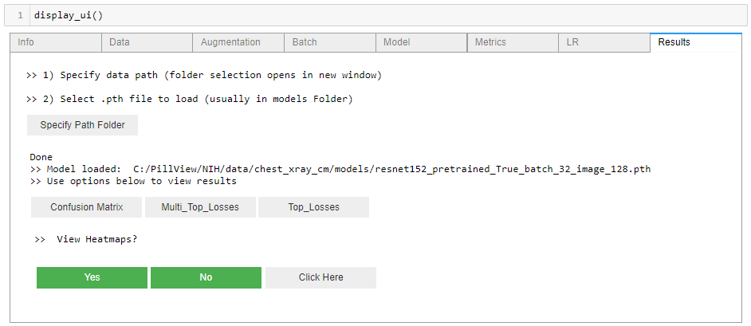

> Option to view images within each section of the matrix

  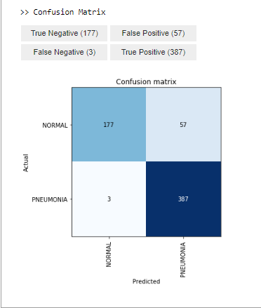

> If heatmap option is 'YES' you can choose colormap, interpolation and alpha parameters

  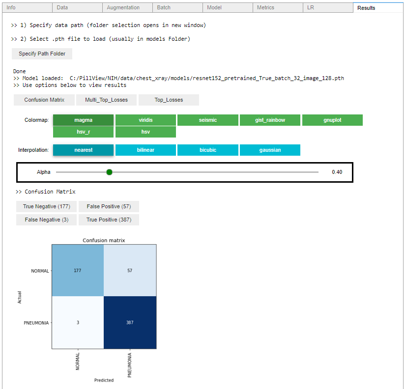

> Examples of using different parameters for viewing images

  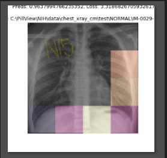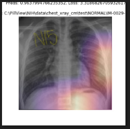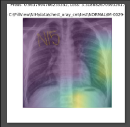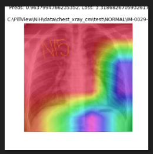

> Also have the option to view the images without the heatmap feature.  Images within each matrix class display Index, Actual_Class, Predicted_Class, Prediction value, Loss and Image location 

  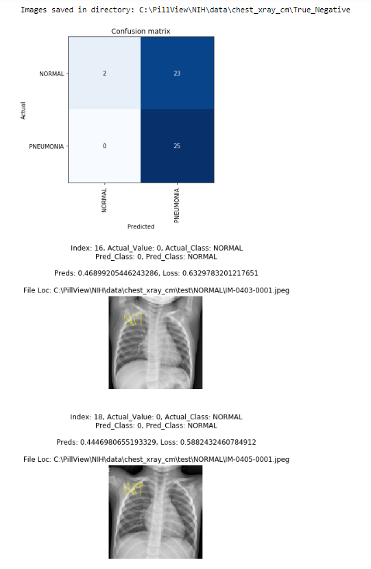

> Images are stored within the path folder under their respective confusion matrix tags

> View saved image files from various sections of the confusion matrix and compare their heatmap images.

  False Positive
  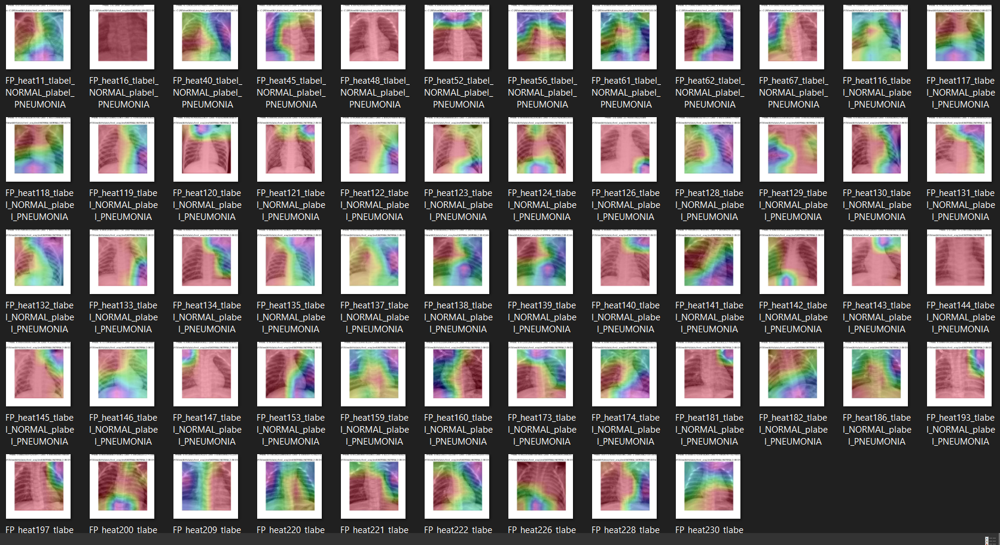 
  True Positive
  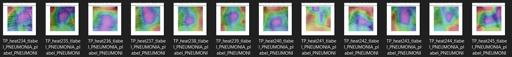 
  True Negative
  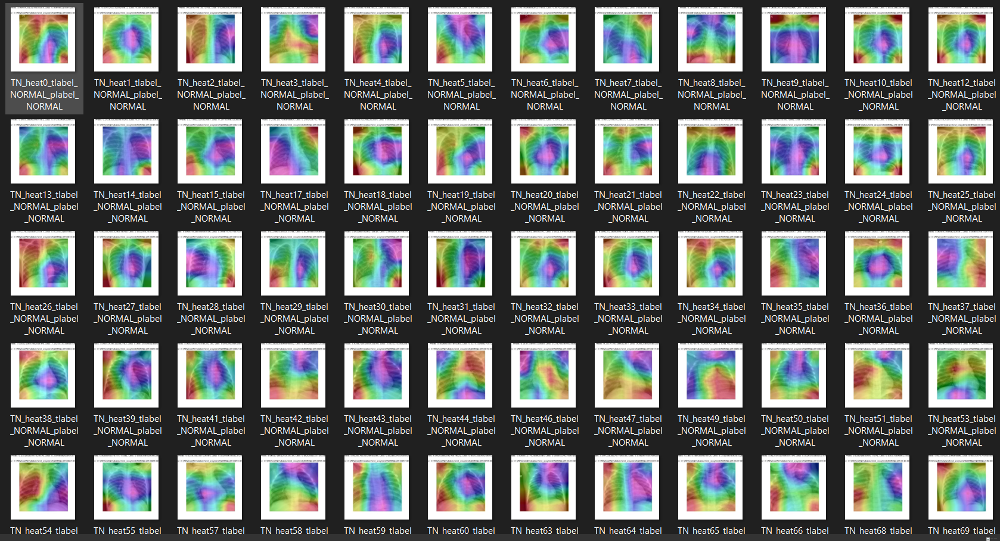
  False Negative
  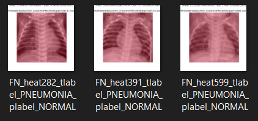

#### 07/09/2019
- after a training run, the model is saved in the models folder with the following name: 'architecture' + 'pretrained' + batchsize + image size eg: resnet50_pretrained_True_batch_32_image_128.pth
- updated tkinter askdirectory code: now after choosing a file the tkinter dialogue box will be destroyed - previously the box would remain open

#### 06/05/2019
- results tab added where you can load your saved model and plot multi_plot_losses, top_losses and Confusion_matrix

#### 06/03/2019  
- path and image_path (for augmentations) is now within vision_ui so no need to have a seperate cell to specify path
- included link to fastai docs and forum in 'info' tab 

________________________________________________________________________________________________________________________________________

All tabs are provided within an accordion design using ipywidgets, this allows for all aspects of choosing and viewing parameters in one line of sight

  

The Augmentation tab utilizes fastai parameters so you can view what different image augmentations look like and compare

  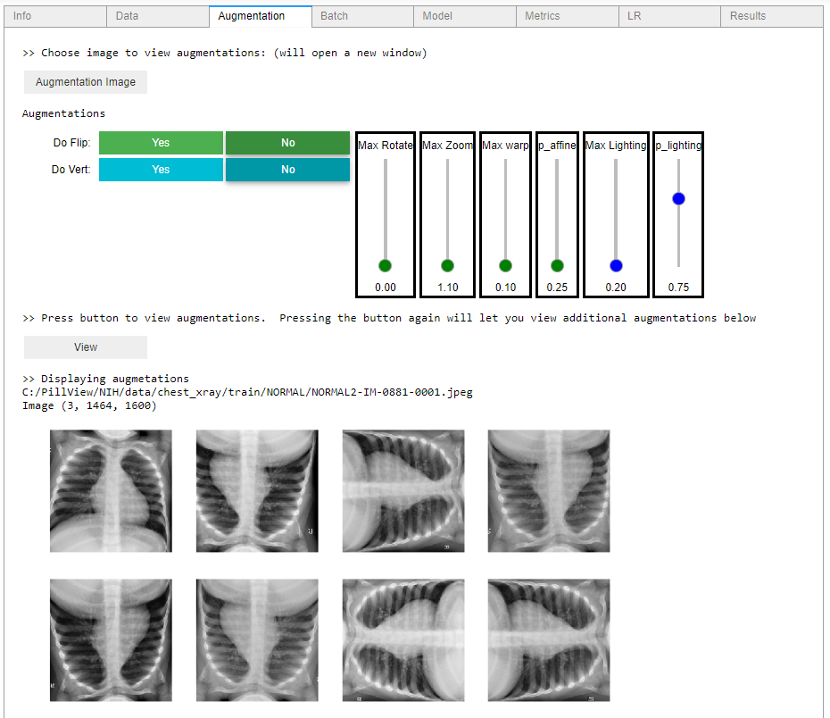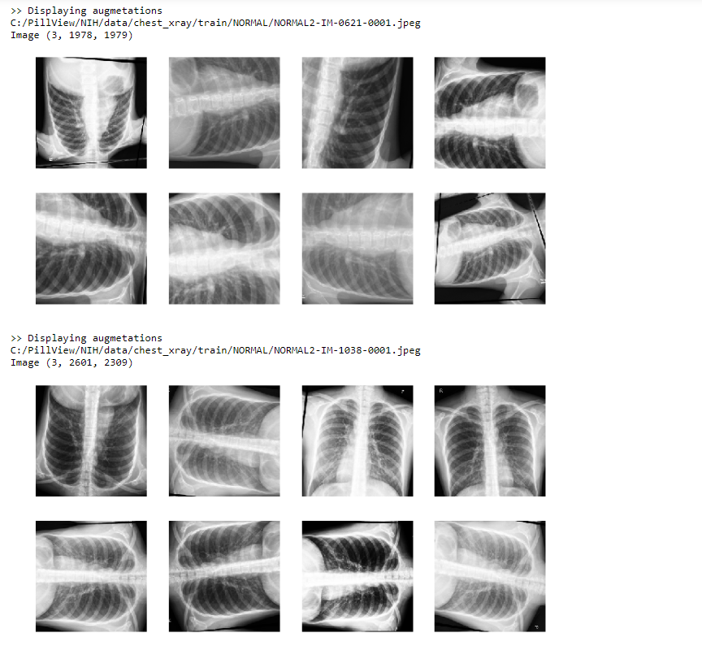

View batch information

  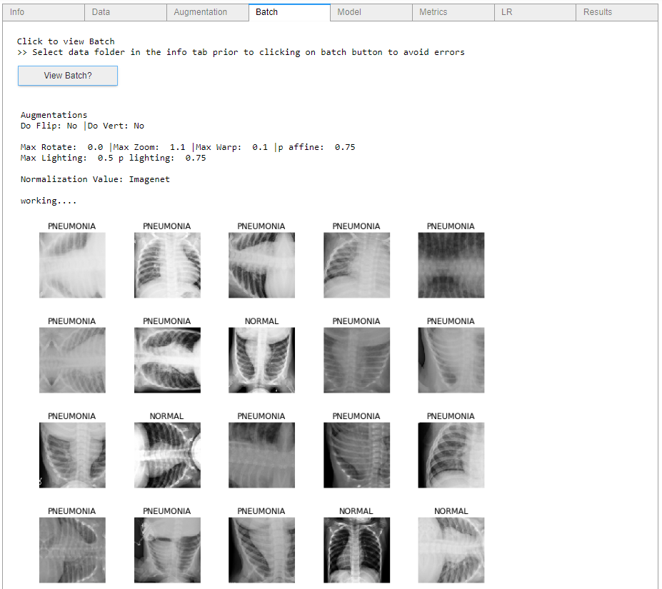

Review model data and choose suitable metrics for training

  

Review parameters get learning rate and train using the one cycle policy

  

Can experiment with various learning rates and train

  

### Requirements
- fastai

I am using the developer version:

  

`git clone https://github.com/fastai/fastai`

`cd fastai`

`tools/run-after-git-clone`

`pip install -e ".[dev]"`

for installation instructions visit [Fastai Installation Readme](https://github.com/fastai/fastai/blob/master/README.md#installation) 

- ipywidgets

`pip install ipywidgets
jupyter nbextension enable --py widgetsnbextension`

or 

`conda install -c conda-forge ipywidgets`

for installation instructions visit [Installation docs](https://ipywidgets.readthedocs.io/en/stable/user_install.html)

- psutil

psutil (process and system utilities) is a cross-platform library for retrieving information on running processes and system utilization (CPU, memory, disks, network, sensors) in Python

`pip install psutil`

### Installation

git clone this repository

`git clone https://github.com/asvcode/Vision_UI.git`

run `Visual_UI.ipynb` and run `display_ui()`

### Known Issues

##### Paperspace

Currently causing [display] issues with tkinter

### Future Work

- Integrate into fastai v2
